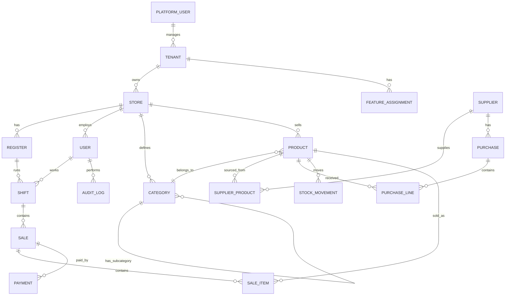

# Database model

This is a practical starting model. Exact field names can change when implementation begins.

## 1. Entity relationship overview

## 2. Platform and tenancy

### tenants

Represents each shop/business customer.

- id
- business_name
- owner_name
- phone
- email
- address
- status: active, suspended, cancelled
- plan_id
- created_at
- updated_at

### stores

Use even if each tenant has one shop now. It keeps multi-branch possible.

- id
- tenant_id
- store_name
- address
- phone
- timezone
- currency
- created_at
- updated_at

### feature_assignments

- id
- tenant_id
- feature_key
- enabled
- limit_value
- enabled_by_platform_user_id
- starts_at
- ends_at
- updated_at

### license_snapshots

Signed snapshot sent to devices.

- id
- tenant_id
- snapshot_json
- signature
- issued_at
- expires_at
- grace_until

## 3. Users and permissions

### users

- id
- tenant_id
- store_id
- name
- username
- email
- phone
- role: store_admin, cashier, manager
- password_hash
- pin_hash
- is_active
- last_login_at
- created_at
- updated_at

### permissions

- id
- permission_key
- description

### user_permissions

- id
- user_id
- permission_key
- allowed

Suggested permission keys:

- product.manage
- supplier.manage
- inventory.adjust
- inventory.damage
- inventory.doubtful
- reports.view
- cashier.override
- sale.discount
- sale.void
- sale.refund
- shift.approve_close

## 4. Registers and devices

### registers

- id
- tenant_id
- store_id
- register_code
- register_name
- is_active

### devices

- id
- tenant_id
- store_id
- register_id
- device_name
- device_fingerprint
- last_seen_at
- last_sync_at
- status

## 5. Catalog

### categories

- id
- tenant_id
- parent_category_id
- name
- code
- sort_order
- is_active

### products

- id
- tenant_id
- store_id
- item_id
- barcode
- name
- description
- brand
- category_id
- unit_of_measure
- serial_tracking_enabled
- cost_price
- retail_price
- wholesale_price
- lot_price
- lot_min_quantity
- tax_rate_id
- reorder_level
- low_stock_threshold
- allow_negative_stock
- is_active
- created_at
- updated_at

### product_price_history

- id
- product_id
- old_price
- new_price
- price_type
- changed_by_user_id
- reason
- changed_at

## 6. Suppliers and purchases

### suppliers

- id
- tenant_id
- store_id
- name
- contact_name
- phone
- email
- address
- payment_terms
- notes
- is_active

### supplier_products

- id
- supplier_id
- product_id
- supplier_item_code
- last_cost_price
- last_supplied_quantity
- last_supplied_at
- minimum_order_quantity

### purchases

- id
- tenant_id
- store_id
- supplier_id
- purchase_number
- purchase_date
- status: draft, received, partially_paid, paid, cancelled
- total_amount
- paid_amount
- outstanding_amount
- created_by_user_id
- created_at

### purchase_lines

- id
- purchase_id
- product_id
- quantity
- cost_price
- line_total
- expiry_date
- batch_number

### supplier_payments

- id
- supplier_id
- purchase_id
- amount
- payment_method
- payment_date
- reference
- notes
- created_by_user_id

## 7. Inventory

### stock_movements

Source of truth for inventory.

- id
- tenant_id
- store_id
- product_id
- movement_type: purchase_receive, sale, sale_return, damage, doubtful, adjustment_increase, adjustment_decrease, transfer_in, transfer_out
- quantity_delta
- unit_cost
- reference_type: sale, purchase, adjustment, damage, doubtful, transfer
- reference_id
- reason
- created_by_user_id
- device_id
- created_at
- synced_at

### inventory_balances

Fast calculated table. Can be rebuilt from stock movements.

- id
- tenant_id
- store_id
- product_id
- quantity_on_hand
- average_cost
- stock_value
- selling_value
- estimated_profit
- updated_at

### inventory_adjustments

- id
- tenant_id
- store_id
- product_id
- old_quantity
- new_quantity
- difference
- reason
- approved_by_user_id
- created_by_user_id
- created_at

### damaged_stock

- id
- tenant_id
- store_id
- product_id
- quantity
- reason
- reference_stock_movement_id
- created_by_user_id
- created_at

### doubtful_stock

- id
- tenant_id
- store_id
- product_id
- quantity
- reason
- reference_stock_movement_id
- created_by_user_id
- created_at

## 8. Sales and payments

### shifts

- id
- tenant_id
- store_id
- register_id
- cashier_user_id
- opened_at
- closed_at
- opening_cash
- expected_cash
- counted_cash
- cash_variance
- status: open, pending_approval, closed
- approved_by_user_id

### sales

- id
- tenant_id
- store_id
- register_id
- shift_id
- cashier_user_id
- receipt_number
- server_invoice_number
- sale_status: completed, voided, refunded, partially_refunded
- subtotal
- discount_total
- tax_total
- total
- created_offline
- local_created_at
- server_received_at
- synced_at

### sale_items

- id
- sale_id
- product_id
- item_name_snapshot
- barcode_snapshot
- quantity
- unit_price
- price_type: retail, wholesale, lot, override
- discount_amount
- tax_amount
- line_total
- cost_price_snapshot

### payments

- id
- sale_id
- payment_method: cash, card, bank_transfer, wallet, voucher, credit
- amount
- reference
- created_at

### cash_drawer_events

- id
- tenant_id
- store_id
- register_id
- shift_id
- event_type: opening_cash, paid_in, paid_out, counted_cash, drawer_open
- amount
- reason
- created_by_user_id
- approved_by_user_id
- created_at

## 9. Sync and audit

### outbox_operations

Local device table.

- id
- tenant_id
- device_id
- operation_type
- entity_type
- entity_id
- payload_json
- status: pending, syncing, synced, failed
- retry_count
- error_message
- created_at
- synced_at

### sync_operations

Server idempotency table.

- id
- tenant_id
- device_id
- operation_id
- operation_type
- entity_type
- entity_id
- payload_hash
- received_at

### sync_conflicts

- id
- tenant_id
- device_id
- entity_type
- entity_id
- local_payload_json
- server_payload_json
- conflict_type
- status: open, resolved, ignored
- resolved_by_user_id
- resolved_at

### audit_logs

- id
- tenant_id
- store_id
- user_id
- role
- device_id
- register_id
- action
- entity_type
- entity_id
- old_values_json
- new_values_json
- reason
- created_offline
- created_at
- server_received_at

